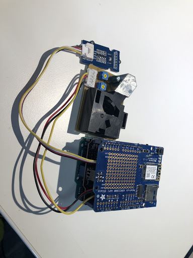

# Create a Device

> _**So how do you make Jess and Jeff?**_

Put simply, all you need are sensors and Arduino technology.

**Arduino **is** **an open-source electronic prototyping platform enabling users to create interactive electronic objects. It provides hardware and software to design  digital devices and compile the data from these objects.&#x20;

Arduino provides a modular system called Shield. We used this system as it allows you to stack, meaning that you can build a device for your own needs and specifications. In this way it is modular and adaptable in every aspect; every single part of the device can be tweaked.&#x20;

 (1).jpg>)

> _**Is that it?**_

Nope, next all you have to do is plug in sensors from a third-party and configure the device to pull the data from these sensors at whatever intervals you desire. So for example, we took information on the hour, every hour.&#x20;

